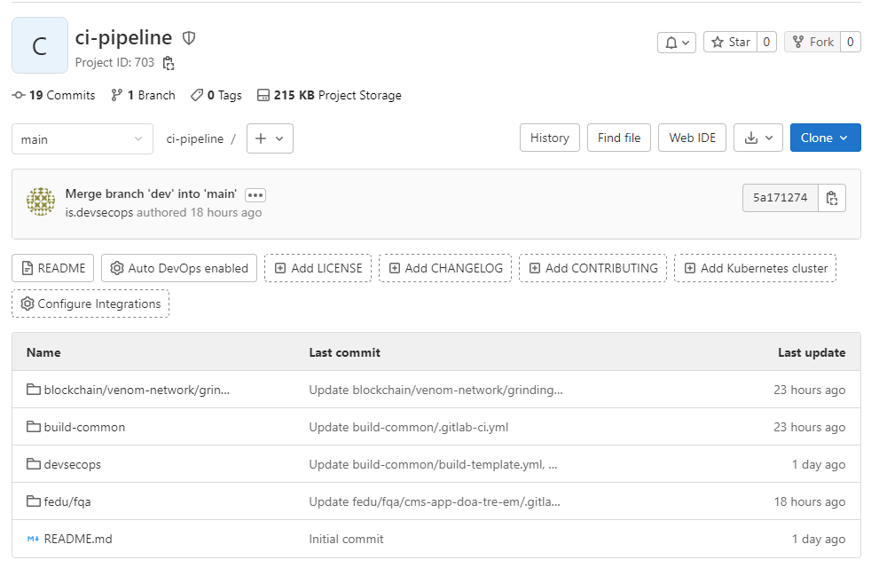
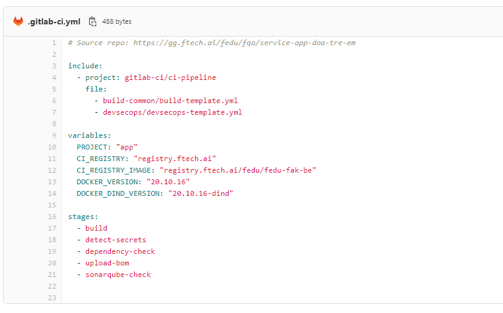
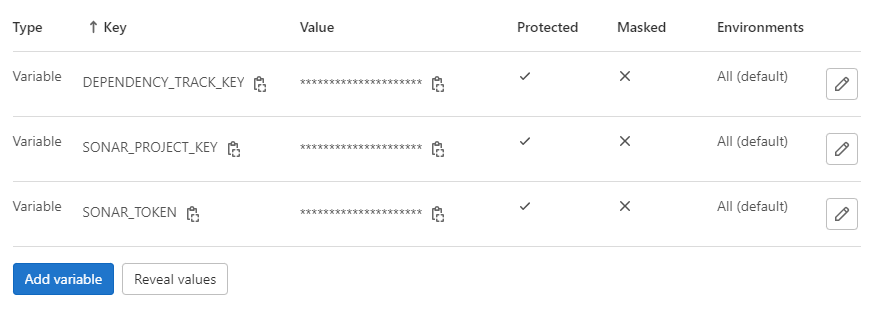
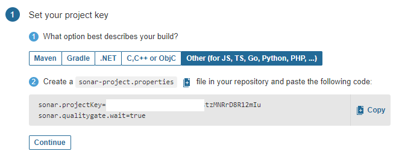
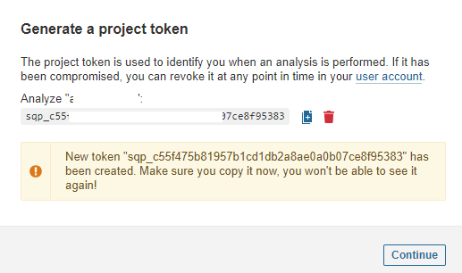
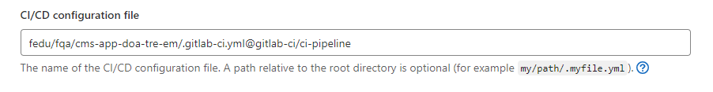

# Devsecops Pipelines

- Link repo ci-pipeline: 
  + https://gg.ftech.ai/gitlab-ci/ci-pipeline

  + https://gitlab.ftech.ai/gitlab-ci/ci-pipeline

- Tạo Folder theo tên project triển khai ci-pipeline.



- Add file `.gitlab-ci.yml.` trong folder đã tạo.
  


- Trong đó:
```sh
  include:
    - project: gitlab-ci/ci-pipeline
```
Đường dẫn project chứa file template.

```sh
  file:
    - build-common/build-template.yml
    - devsecops/devsecops-template.yml
```
Đường dẫn folder chứa file template.

```sh
  variables:
    PROJECT: "project-name"
    CI_REGISTRY: "registry.ftech.ai"
    CI_REGISTRY_IMAGE: "registry.ftech.ai/abc/xyz"
    DOCKER_VERSION: "20.10.16"
    DOCKER_DIND_VERSION: "20.10.16-dind"  
```
Variables project triển khai ci-pipeline.

```sh
  stages:
  - build
  - detect-secrets
  - dependency-check
  - upload-bom
  - sonarqube-check
```
Stages CI/CD.

- Đối với stage `detect-secret` exclude false positive theo folder hoặc theo secret như sau:

```sh
EXCLUDE_SECRETS: "bckjxzbkjcq8228rja0czxi13h23roihsaoasjk|12345678Aa"

EXCLUDE_FOLDERS: "static;store/static;abcd"
```

- Đối với project triển khai ci-pipeline.

   - Setting > CI/CD > Variables.



   - Setting varibale SonarQube





   - Setting > CI/CD > General pipelines. 



- Nếu cấu hình CI/CD không nằm trong thư mục gốc

  - Example:
  
```sh
  my/path/.gitlab-ci.yml
  my/path/.my-custom-file.yml
```

- Nếu cấu hình CI/CD nằm trong một project khác

  - Example:
```sh
  .gitlab-ci.yml@mygroup/another-project
  my/path/.my-custom-file.yml@mygroup/another-project
  my/path/.my-custom-file.yml@mygroup/another-project:refname
```

Reference: [Link](https://docs.gitlab.com/ee/ci/pipelines/settings.html#specify-a-custom-cicd-configuration-file)